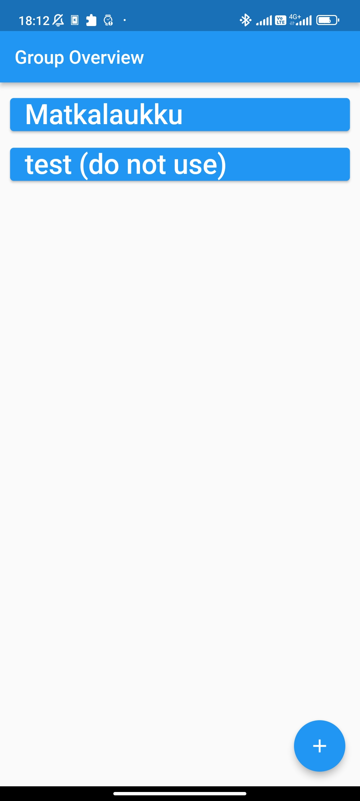
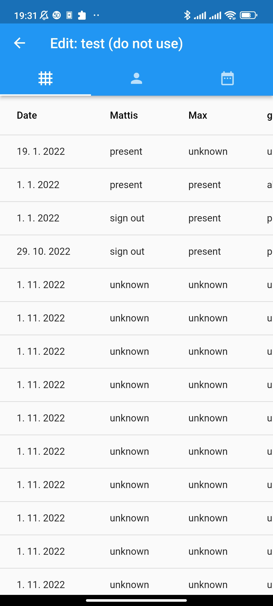
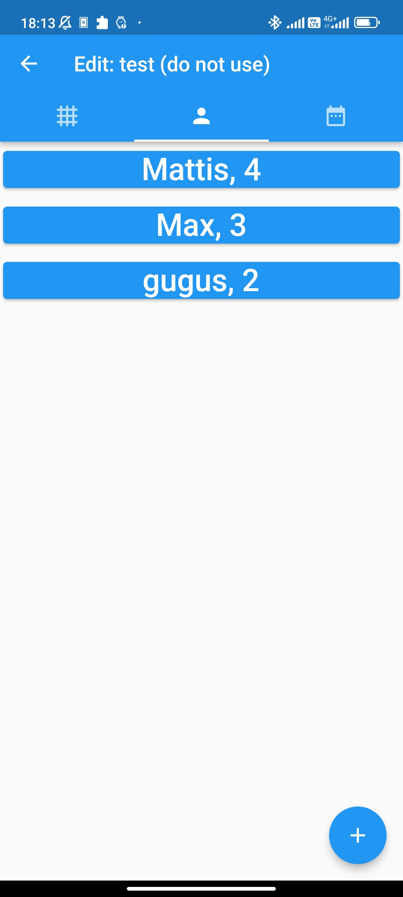
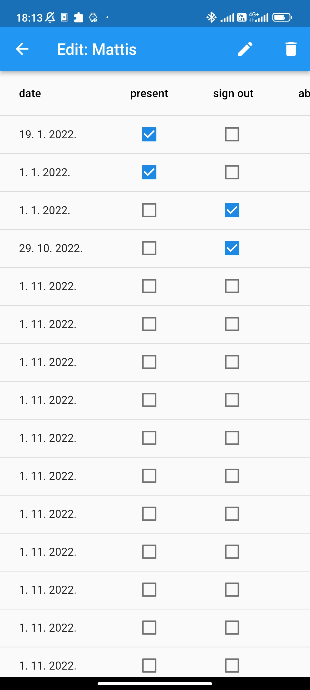
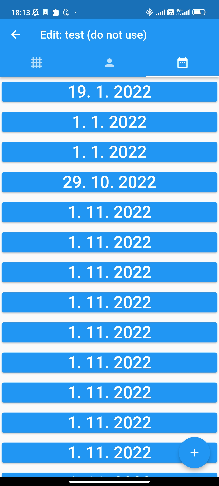
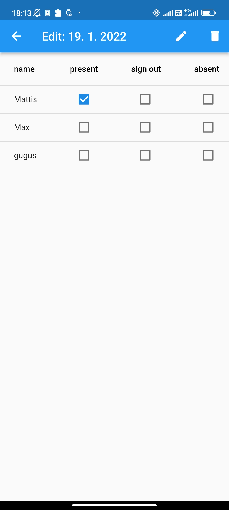

# attendence
A simple way to keep track of who attends your events.

## Facts or so:
 - backend: Supabase
 - frontend: Dart (Flutter)
 - intended platform: Mobile (Android)

## Overview:

groups:
<br> 

people & dates table:
<br> 

people overview:
<br> 

person edit attendance:
<br> 

dates:
<br> 

date edit attendance:
<br> 


## Setup:
1. create Supabase Project
2. put URL & Key in .env file (example: .env.example)
3. create database table
```sql
CREATE TABLE attendenceData (
    id bigint NOT NULL PRIMARY KEY,
    created_at timestamp with time zone DEFAULT now(),
    name text,
    passwd text,
    data json DEFAULT '{"dates":[],"people":[]}'::json
);
```
4. compile
```console
flutter pub get && flutter build apk --release
```
5. install
